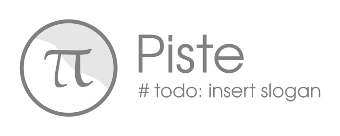

## Introduction

Piste is a reimplementation of the Pict[1, 2] programming language which, in turn, is a realization of the π-calculus [3] as a programming language.

## References
[1] Turner, D. N. (1995). The Polymorphic Pi-calulus: Theory and Implementation [University of Edinburgh]. In PhD Thesis. [https://era.ed.ac.uk/handle/1842/395](https://era.ed.ac.uk/handle/1842/395)

[2] Pierce, B. C., & Turner, D. N. (2000). Pict: A Programming Language Based on the Pi-Calculus. Proof, Language and Interaction: Essays in Honour of Robin Milner, 455–494.

[3] Sangiorgi, D., & Walker, D. (2003). The π-calculus : a theory of mobile processes. Cambridge University Press.